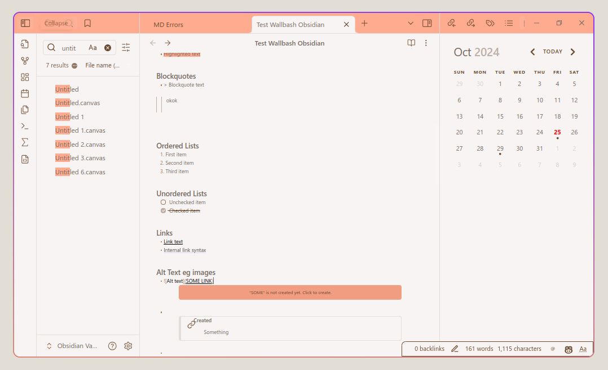
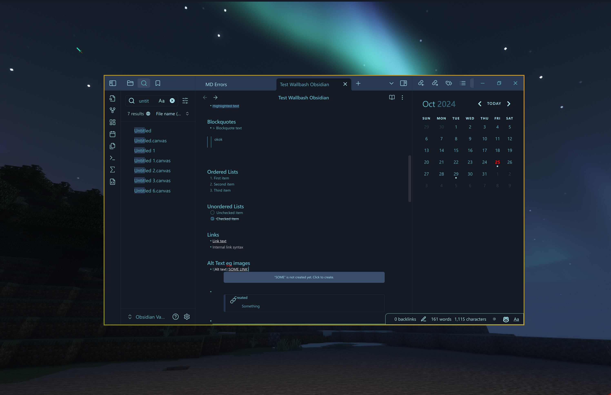
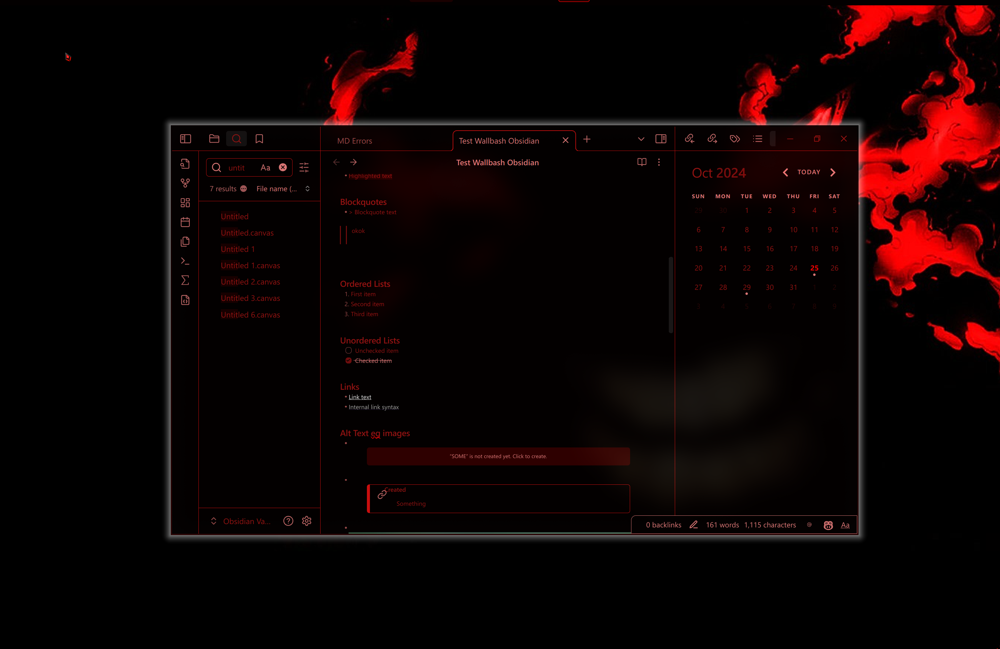
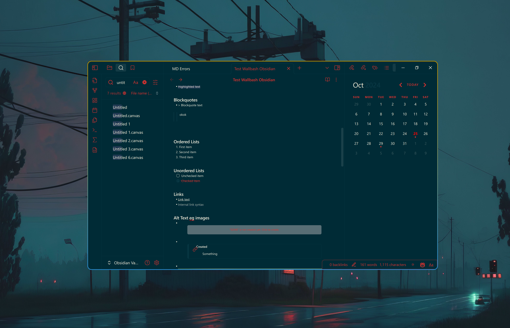
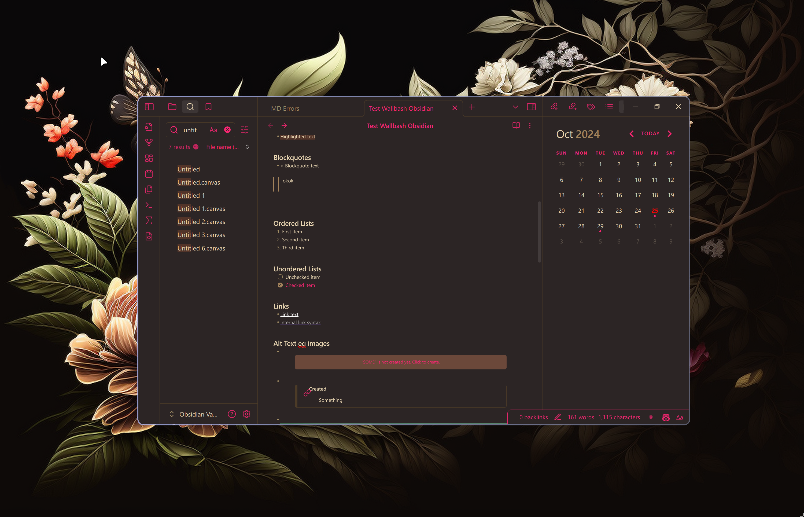
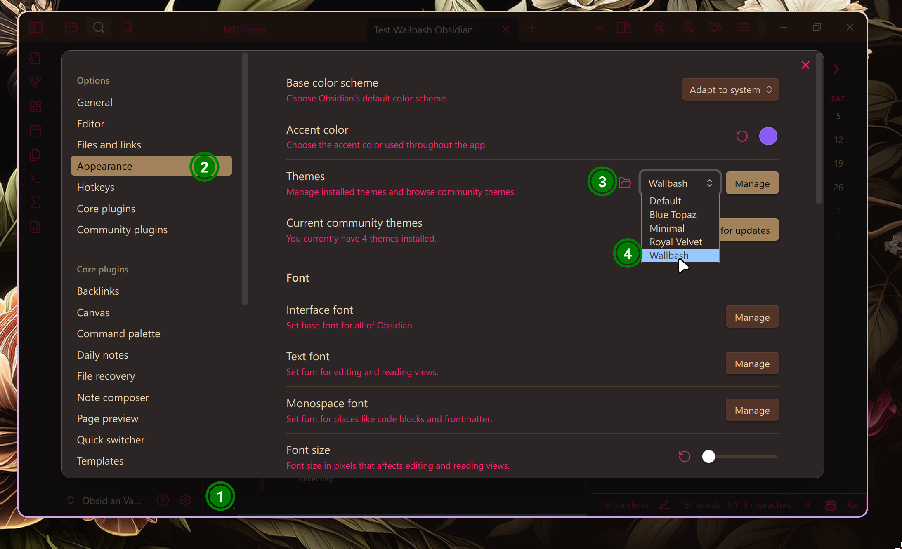

# obsidian

HyDE's wallbash template for Obsidian.

## Preview:







## Installation:

1. clone this repo to your obsidian vault's `.obsidian/themes/` directory.

- Take note that the initial obsidian vault is located at `~/Documents/Obsidian Vault/`,
  however this is not always the case.
  Therefore, you may need to set the `OBSIDIAN_VAULT` environment variable to the correct path.
  This can be done by adding the following:
  - setting it in ` ~/.config/hyde/hyde.conf` ` OBSIDIAN_VAULT=/path/to/your/obsidian/vault` (Recommended)
  - or setting the env in ` hyprland.conf` ` env = OBSIDIAN_VAULT,/path/to/your/obsidian/vault`
  - or line to your `.bashrc` or `.bash_profile` file or similar rc files

```bash
export OBSIDIAN_VAULT="${HOME}/Documents/Obsidian Vault/"
git clone https://github.com/HyDE-Project/obsidian "${OBSIDIAN_VAULT}/.obsidian/themes/Wallbash/"
cd "${OBSIDIAN_VAULT}/.obsidian/themes/Wallbash/"
```

2. Now we need to have a copy of the `obsidian.dcol` file in the `~/.config/hyde/wallbash/Wall-Ways` directory.

```bash
cp ./obsidian.dcol ~/.config/hyde/wallbash/Wall-Ways/

```

3. Run ` Hyde reload` to apply the changes.

- This will generate the `theme.css` file.

4. Set the theme in Obsidian settings.
   - ⚙Setting > Appearance️ > 📁 Open themes folder️ > Select Wallbash
     

## Updating:

1. Navigate to you obsidian vault
2. cd ./Wallbash
3. git pull
4. `cp ./obsidian.dcol ~/.config/hyde/wallbash/Wall-Ways/ `
5. `Hyde reload`

## TODO

- [ ] Add a script to automate the installation process
