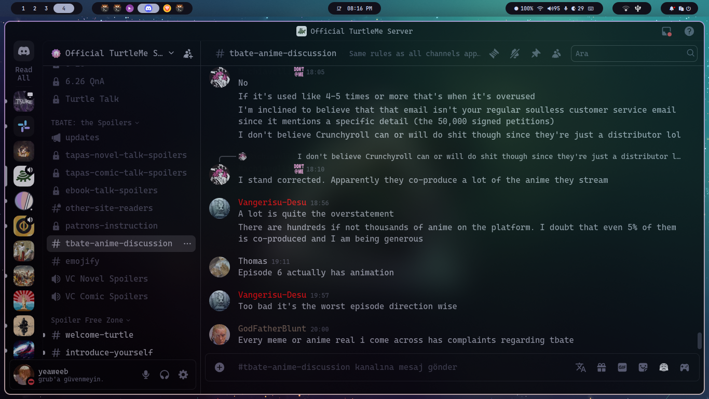

# My Dotfiles
Installing HyDE after minimal archinstall installs conflicting network managers which can cause disconnects. Run this to fix that
```bash
sudo systemctl disable --now iwd.service
sudo pacman -R iwd
sudo systemctl restart NetworkManager.service
```
Reboot after that

## Screenshots




